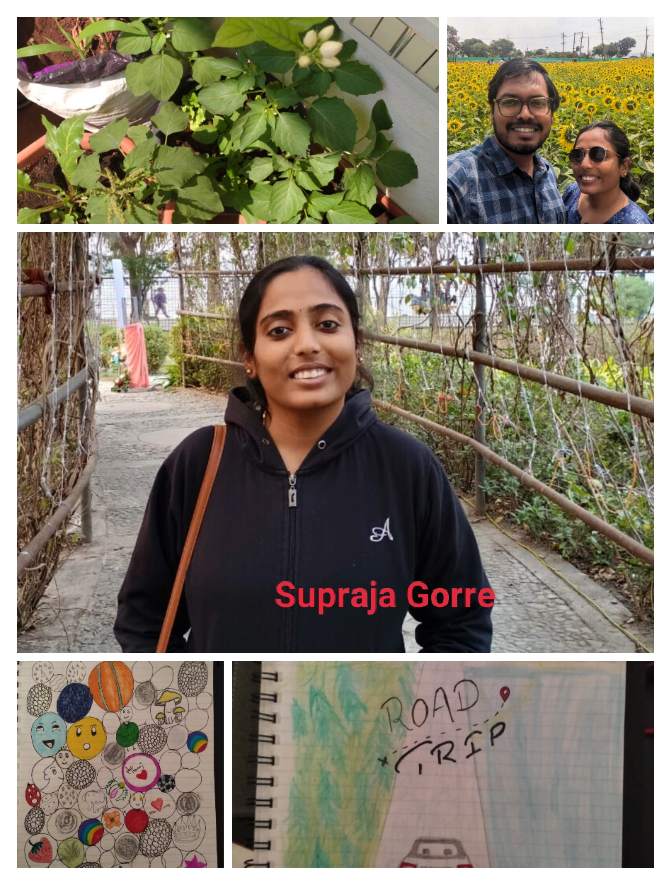

```{r echo=FALSE, warning=FALSE}
library(DiagrammeR)
grViz("digraph flowchart {
      # node definitions with substituted label text
      node [fontname = Helvetica, shape = rectangle]        
      tab1 [label = 'CMS India (PP)']
      tab2 [label = 'Biostatistics (PP)']
      tab3 [label = 'Real World Evidence (PP)']
      tab4 [label = 'Data Science (AC)']
      tab5 [label = 'Admin (Kalyan)']
      tab6 [label = 'Analystical programming & Standards']
      tab7 [label = 'Data Engeneering']
      tab8 [label = 'Systems & Automation']

      # edge definitions with the node IDs
      tab1 -> tab2;
      tab1 -> tab3;
      tab1 -> tab4;
      tab4 -> tab6;
      tab4 -> tab7;
      tab4 -> tab8;
      tab1 -> tab5
      }

      ")
```
# About us
 Some text about the team and locations and some team pictures.
 
# Parasar Pal 
## Anik
### Sujoy   
info

### Supraja Gorre   

<div style="display: flex; align-items: center;">
  <div style="flex: 1;">
    <p>Associate principal Statistical programmer,Have 9 years of experience . Previously worked with Bayer as Senior Statistical Programmer. In this role, got exposure in therapeutic areas like Cardiovascular, Women's Health, Ophthalmology, Kidney disease. Have expertise in programming languages SAS, R & Python.
Postgraduate in Statistics from Central university of Hyderabad. Lives in Bangalore. Love cooking & a big foody, balances it out with yoga and exercise. Occupies free time with reading books.</p>
  </div>
  <div style="flex: 1;">
    
  </div>
</div>

